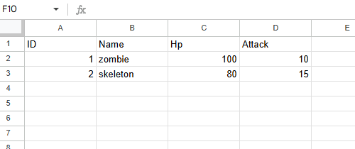
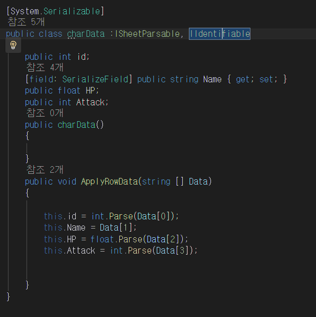
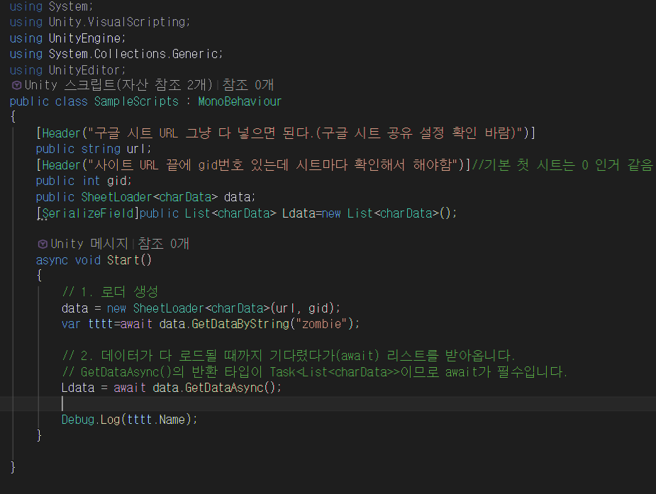
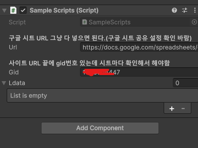
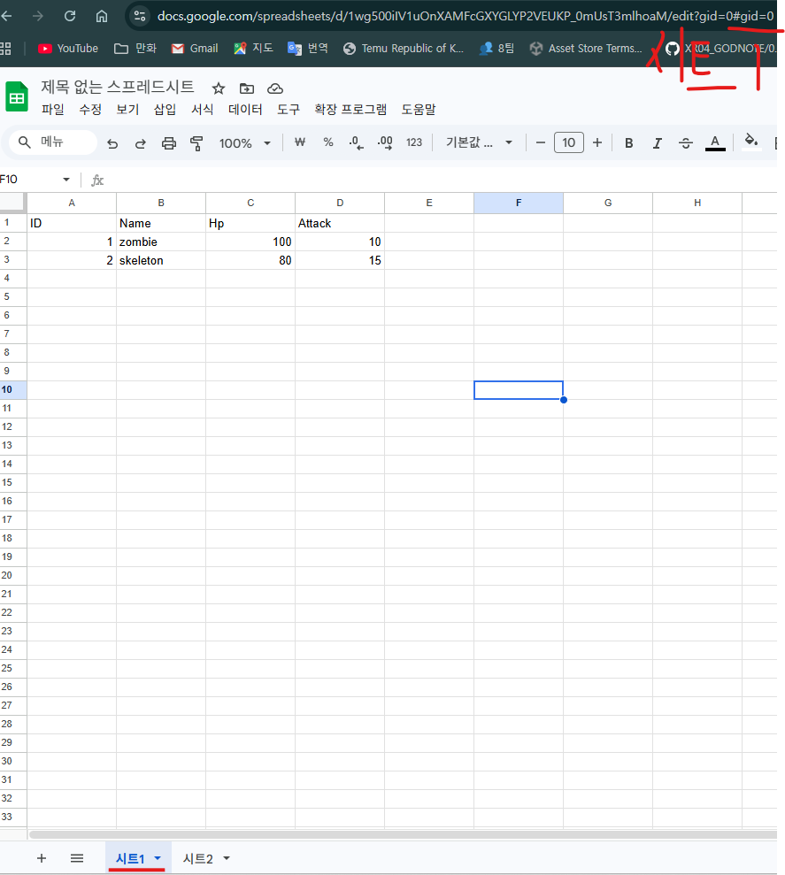
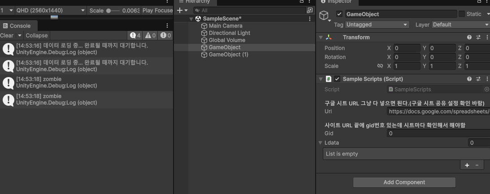

# 모든 타입  고려 구글시트 데이터 파싱

## 만들어진 이유
- 만들 때 마다 특정 데이터 타입으로 역직렬화하는게 불편해서.
- 범용성 있게 만들면 좋을거 같아서 제작.

---

## 사용방법(구글 시트전용)

```SheetLoader<T>``` 를 사용하여 구글시트 데이터를 파싱을 함  
- 1. 구글 시트에서 액세스를 링크가 있는 모든 사용자로 변경


- 2. 구글 시트에 기록된 데이터를 확인 후  정보를 담을  클래스 제작 
  - ISheetParsable, IIdentifiable 인터페이스를 사용해야 함.



- 3. 데이터를  관리할 스크립트 작성


- 4.URL & gid 확인하기

위에 그림과 같이 이제 초기화 하는과정 에서 url 과 gid를 넘기는데  
해당 url 구글 시트에서 몇번째 시트인지 판별하기위해 gid 같이 넘김  





----

데이터 파싱 결과
일부러 똑같은거 출력하긴 했는데   

시트1, 시트2의 zombie 잘 출력되는게 보인다. 

