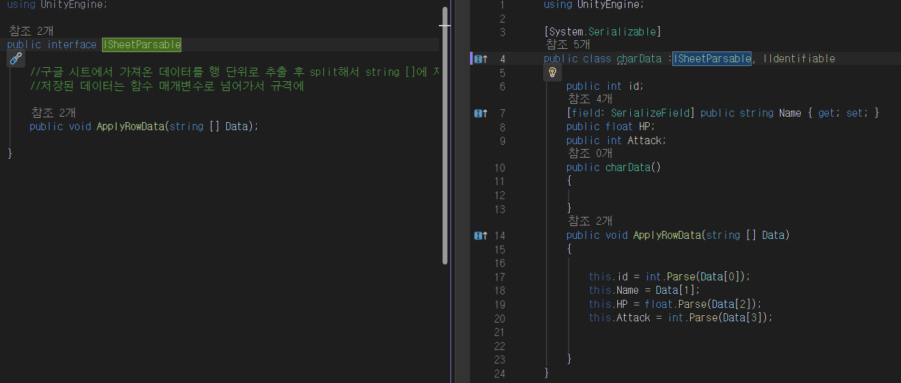
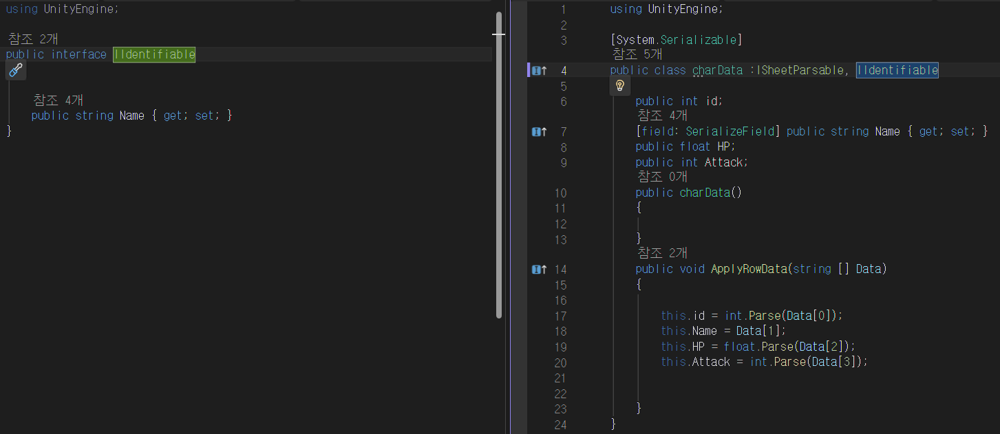

# 모든 타입  고려 구글시트 데이터 파싱

## 만들어진 이유
- 이런 스프레드 시트 파싱 만들 때 마다 좀 하드코딩 하는거 같아서.
- 범용성 있게 만들면 좋을거 같아서 제작.
- 구글 시트 전용임.

---

## 사용방법(구글 시트전용)

```SheetLoader<T>``` 를 사용하여 구글시트 데이터를 파싱을 함  
- 1. 구글 시트에서 액세스를 링크가 있는 모든 사용자로 변경


- 2. 구글 시트에 기록된 데이터를 확인 후  정보를 담을  클래스 제작 
  - ISheetParsable, IIdentifiable 인터페이스를 사용해야 함.


- 3. 데이터를  관리할 스크립트 작성


- 4.URL & gid 확인하기

위에 그림과 같이 이제 초기화 하는과정 에서 url 과 gid를 넘기는데  
해당 url 구글 시트에서 몇번째 시트인지 판별하기위해 gid 같이 넘김  


----

데이터 파싱 결과
일부러 똑같은거 출력하긴 했는데   

시트1, 시트2의 zombie 잘 출력되는게 보인다. 


---
### ISheetParsable, IIdentifiable 사용한 이유

- 먼저  ISheetParsable  
파싱한 데이터를 어떻게 담을지 모르는 상황이니   
인터페이스 하나 만들어서 하나의 행 데이터들을 받아오면   
데이터 구조에 맞게 역직렬화가 가능하기 때문에 인터페이스 사용



---

다음 IIdentifiable  
이름으로 찾는게 편해서  string 프로퍼티를 하나 인터페이스로 만듦

로드한 데이터들 중 특정 이름으로 데이터로 가져다 쓸 때 편함

